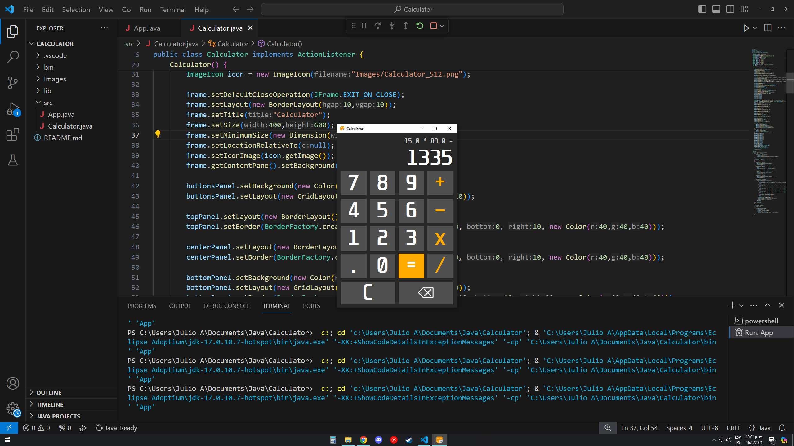
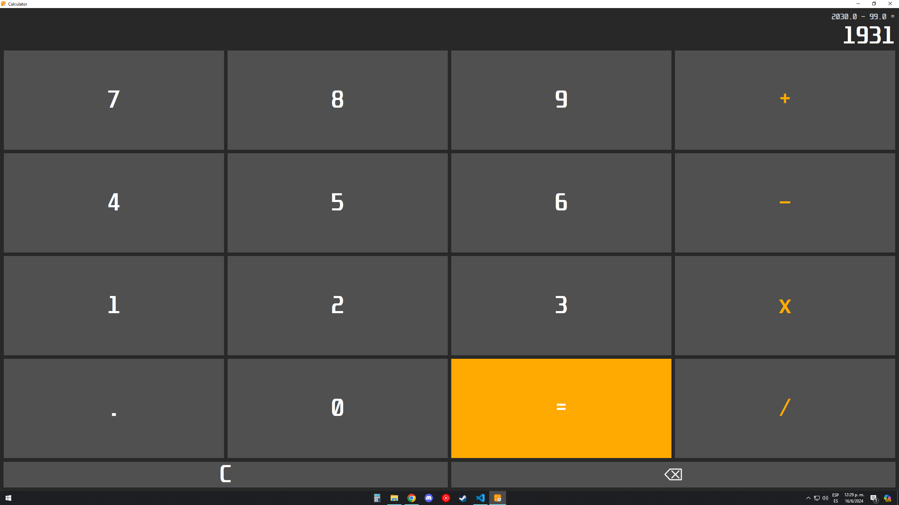
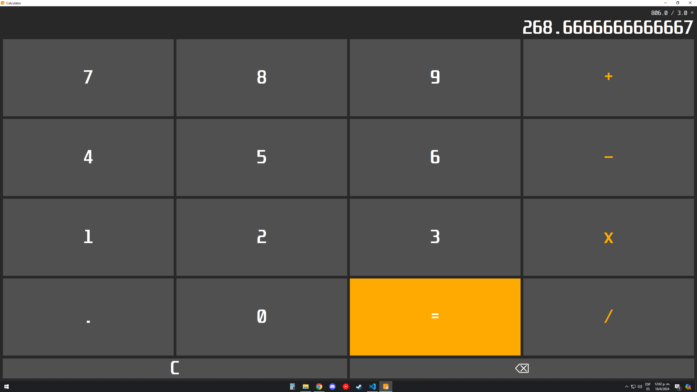

# Calculator
Basic calculator using Java Swing with adjustable size and decimal numbers.

## Built with:
Java

## Features:
- Basic calculator functions such as addition, subtraction, multiplication and division 
- Handles decimal numbers
- Shows previous operations
- Erase numbers one by one or all numbers at once
- Adjustable size

## How to use:
1. Install java
2. Run the program

## Credits:
Julio Salazar
